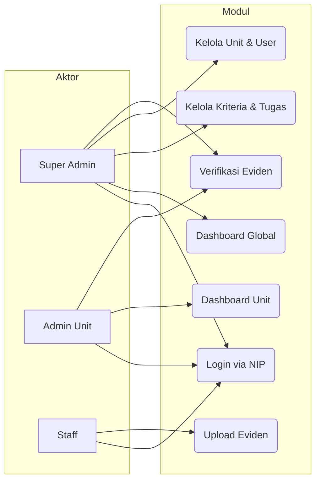

<div align="center">


# SIKAP — PLN
### Sistem Informasi Kepatuhan dan Pemantauan


</div>

---

## 📌 Tentang Proyek

**SIKAP** (*Sistem Informasi Kepatuhan dan Pemantauan*) adalah platform web internal PLN untuk mengelola, memantau, dan memverifikasi kepatuhan keamanan di seluruh unit kerja. Sistem ini menggantikan proses pelaporan manual berbasis spreadsheet dengan antarmuka digital yang terstruktur, terverifikasi, dan dapat dipantau secara *real-time*.

### 🎯 Tujuan Sistem
- Memudahkan **staff** melaporkan bukti (eviden) kepatuhan keamanan per kriteria
- Membantu **Admin Unit** memverifikasi dan memantau progres unit di bawahnya
- Memberikan **Super Admin** visibilitas penuh terhadap tingkat kepatuhan seluruh unit

---

## ✨ Fitur Utama

| Fitur | Deskripsi |
|---|---|
| 🔐 **Login via NIP** | Autentikasi menggunakan Nomor Induk Pegawai (NIP) |
| 📋 **Spreadsheet-like Task Grid** | Tampilan daftar tugas keamanan yang expandable per kriteria |
| 📤 **Upload Eviden** | Staff dapat mengunggah dokumen bukti kepatuhan |
| ✅ **Verifikasi Eviden** | Admin dapat menyetujui, meminta revisi, atau menolak eviden |
| 📊 **Dashboard Monitoring** | Grafik dan tabel rekapitulasi kepatuhan per unit secara real-time |
| 👥 **Manajemen Multi-level** | Hierarki unit: UID → UP3 → ULP |
| 📝 **Audit Trail** | Semua aksi kritis tercatat otomatis |

---

## 🏗️ Arsitektur Sistem

```
┌──────────────────────┐        ┌──────────────────────────┐
│   React 18 + Vite    │ ──────►│    Laravel 11 REST API   │
│   (Frontend SPA)     │◄────── │    /api/v1/*             │
└──────────────────────┘  JSON  └────────────┬─────────────┘
                                             │ Eloquent ORM
                                ┌────────────▼─────────────┐
                                │    MySQL 8 Database       │
                                │  users · units · tasks    │
                                │  kriteria · submissions   │
                                └──────────────────────────┘
```

---

## 🎨 Palet Warna

| Preview | Hex | Penggunaan |
|---|---|---|
| 🟦 | `#125d72` | Sidebar, header utama |
| 🩵 | `#14a2ba` | Tombol aksi, link aktif |
| 🩶 | `#e7f6f9` | Background halaman, card |
| 🟡 | `#efe62f` | Badge status pending, alert |
| ⬜ | `#d9d9d9` | Border, divider, placeholder |

---

## 🚀 Cara Menjalankan Proyek

### Prasyarat
- PHP >= 8.2
- Composer 2
- Node.js >= 18 & npm
- MySQL 8 / MariaDB
- Laragon (Windows) atau server sejenis

---

### 🗄️ Backend (Laravel)

```bash
# 1. Clone repository
git clone https://github.com/Abdillah7742/SIKAP-PLN.git
cd SIKAP-PLN

# 2. Masuk ke folder backend
cd backend

# 3. Install dependensi PHP
composer install

# 4. Salin file environment
cp .env.example .env

# 5. Generate application key
php artisan key:generate

# 6. Konfigurasi database di .env
# DB_DATABASE=sikap_pln
# DB_USERNAME=root
# DB_PASSWORD=

# 7. Jalankan migrasi dan seeder
php artisan migrate --seed

# 8. Link storage untuk file upload
php artisan storage:link

# 9. Jalankan server development
php artisan serve
# ➜ API tersedia di: http://localhost:8000/api/v1
```

---

### 🎨 Frontend (React + Vite)

```bash
# 1. Masuk ke folder frontend
cd frontend

# 2. Install dependensi Node.js
npm install

# 3. Salin file environment
cp .env.example .env.local

# 4. Konfigurasi API URL di .env.local
# VITE_API_URL=http://localhost:8000/api/v1

# 5. Jalankan server development
npm run dev
# ➜ Aplikasi tersedia di: http://localhost:5173
```

---

### 👤 Akun Default (Superadmin)

Setelah menjalankan seeder, akun superadmin tersedia:

| Field | Value |
|---|---|
| **NIP** | `1234567890` |
| **Password** | `password` |

> ⚠️ **Wajib ganti password sebelum deployment ke production!**

---

## 📁 Struktur Repository

```
SIKAP-PLN/
├── backend/                    ← Laravel 11 API
│   ├── app/
│   │   ├── Http/Controllers/Api/
│   │   ├── Models/
│   │   └── Services/
│   ├── database/
│   │   ├── migrations/
│   │   └── seeders/
│   └── routes/api.php
│
├── frontend/                   ← React 18 + Vite
│   ├── src/
│   │   ├── components/
│   │   ├── pages/
│   │   ├── store/
│   │   └── services/
│   └── vite.config.js
│
├── Rancangan/                  ← Dokumentasi desain sistem
│   ├── Backend.md
│   ├── FE-Keamanan.md
│   ├── Tools-dan-Perbandingan.md
│   └── Pertanyaan.md
│
└── README.md
```

---

## 🔑 Role & Hak Akses

| Role | NIP Login | Hak Akses |
|---|---|---|
| **Super Admin** | ✅ | Kelola semua unit, user, kriteria, dashboard global |
| **Admin Unit** | ✅ | Verifikasi eviden, monitoring unit sendiri |
| **Staff** | ✅ | Upload eviden, lihat status laporan sendiri |

> Superadmin dibuat via seeder. Admin Unit & Staff dibuat oleh Superadmin melalui halaman manajemen user.

---

## 📊 Modul Sistem



---

## 🛡️ Keamanan

- Token autentikasi via **Laravel Sanctum** (expire 24 jam)
- Otorisasi berbasis **Role & Permission** (Spatie)
- File upload dibatasi: `.pdf`, `.jpg`, `.png`, `.xlsx` — maks **10MB**
- **Rate limiting** 60 request/menit per IP
- Semua aksi kritis tercatat di **Audit Log**

---

## 📄 Dokumentasi Rancangan

| Dokumen | Isi |
|---|---|
| [📦 Backend.md](./Rancangan/Backend.md) | ERD, API endpoint, folder struktur, flowchart |
| [🎨 FE-Keamanan.md](./Rancangan/FE-Keamanan.md) | Design tokens, wireframe, komponen UI |
| [🔧 Tools-dan-Perbandingan.md](./Rancangan/Tools-dan-Perbandingan.md) | Perbandingan tools & alasan pemilihan stack |
| [❓ Pertanyaan.md](./Rancangan/Pertanyaan.md) | Daftar pertanyaan untuk wawancara stakeholder |

---

## 🤝 Kontribusi

Proyek ini bersifat **internal PLN** dan tidak menerima kontribusi publik.  
Untuk pertanyaan atau pengembangan lebih lanjut, hubungi tim pengembang internal.

---

<div align="center">

**SIKAP PLN** — *Monitoring Keamanan yang Terstruktur & Terverifikasi*

Made with ❤️ for PLN Internal Use

</div>
